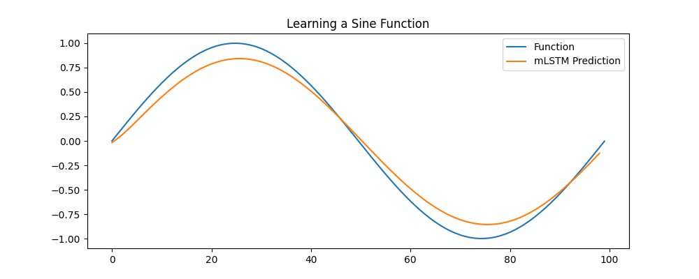

# MLX xLSTM

A pure [MLX](https://github.com/ml-explore/mlx) implementation of [xLSTM: Extended Long Short-Term Memory](https://arxiv.org/abs/2405.04517) by Beck et al. (2024)

# Install 

Use the following commands to install the package:

```bash
git clone github
cd mlx-xLSTM/
pip install -r requirement.txt
pip install -e .
```

# Usage

If you're interested, I've created training examples in the [examples/](./examples/) directory, which showcase the different models on a variety of learning tasks.

## mLSTM Training

Here is a brief example of how to train a `mLSTM` model using this package and mlx.

```python
from mlx_xlstm import mLSTM

def loss_fn(model, X, states, y):
    return nn.losses.mse_loss(model(X, states)[0], y) # choose loss function

input_size = 1
hidden_size = 10
num_layers = 10

model = mLSTM(input_size, hidden_size, num_layers)
mx.eval(model.parameters())

loss_and_grad_fn = nn.value_and_grad(model, loss_fn)

optimizer = optim.Adam(learning_rate=0.01) # choose optimizer 

data = ... # choose dataset

for t in range(seq_len - 1):
    x = data[:, t]
    y_true = mx.broadcast_to(data[:, t+1], (hidden_size, input_size))
    l, grads = loss_and_grad_fn(model, x, states, y_true)

    optimizer.update(model, grads)
    mx.eval(model.parameters(), optimizer.state)
```

For more detail refer to [examples/train_mLSTM.py](./examples/train_mLSTM.py), where I trained a model to predict a sine function.



# Roadmap

- [ ] Implenent sub-components
    - [x] `mLSTM` implementation
    - [ ] `sLSTM` implementation
- [ ] Add full `xLSTM` implementation
- [ ] Add training examples

# Citations

```bibtex
@software{mlx2023,
  author = {Awni Hannun and Jagrit Digani and Angelos Katharopoulos and Ronan Collobert},
  title = {{MLX}: Efficient and flexible machine learning on Apple silicon},
  url = {https://github.com/ml-explore},
  version = {0.0},
  year = {2023},
}
```

```bibtex
@article{beck2024xlstm,
  title={xLSTM: Extended Long Short-Term Memory},
  author={Beck, Maximilian and P{\"o}ppel, Korbinian and Spanring, Markus and Auer, Andreas and Prudnikova, Oleksandra and Kopp, Michael and Klambauer, G{\"u}nter and Brandstetter, Johannes and Hochreiter, Sepp},
  journal={arXiv preprint arXiv:2405.04517},
  year={2024}
}
```

# References

- [xLSTM: Extended Long Short-Term Memory](https://arxiv.org/abs/2405.04517) arXiv Paper
- [andrewgcodes/xlstm](https://github.com/andrewgcodes/xlstm) - PyTorch mLSTM + training example
- [myscience/x-lstm](https://github.com/myscience/x-lstm) - PyTorch mLSTM 
