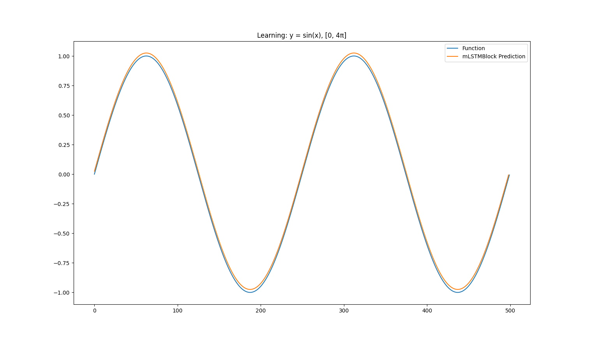

# MLX xLSTM

A pure [MLX](https://github.com/ml-explore/mlx) implementation of [xLSTM: Extended Long Short-Term Memory](https://arxiv.org/abs/2405.04517) by Beck et al. (2024)

## Install 

Use the following commands to install the package:

```bash
git clone git@github.com:abeleinin/mlx-xLSTM.git
cd mlx-xLSTM/
pip install -r requirement.txt
pip install -e .
```

## Usage

The models are implemented in their own respective python files in the [mlx_xlstm/](./mlx_xlstm/) directory. Here is an overview of what models are currently implemented:

| files                            | description                                                                                                           |
|----------------------------------|-----------------------------------------------------------------------------------------------------------------------|
| [mLSTM.py](./mlx_xlstm/mLSTM.py) | implements `mLSTM` and `mLSTMBlock` shown in [(Figure 10)](https://arxiv.org/pdf/2405.04517.pdf#page=30)              |
| [sLSTM.py](./mlx_xlstm/sLSTM.py) | implements `sLSTMCell`, `sLSTM`, and `sLSTMBlock` shown in [(Figure 9)](https://arxiv.org/pdf/2405.04517.pdf#page=29) |
| [xLSTM.py](./mlx_xlstm/xLSTM.py) | implements `xLSTM`                                                                                                    |

If you're interested, I've also created a simple training example in the [examples/](./examples/) directory, which showcases how to use the different models on a simple learning task.

### mLSTM Training

Here is a brief example on how to train a `mLSTMBlock` in mlx:

```python
import mlx.core as mx
import mlx.nn as nn
import mlx.optimizers as optim

from mlx_xlstm import mLSTMBlock

def loss_fn(model, X, states, y):
    return nn.losses.mse_loss(model(X, states)[0], y) # choose loss function

input_size = 1
head_dim = 4
head_num = 8

batch_size = 5

model = mLSTMBlock(input_size, head_dim, head_num)
mx.eval(model.parameters())

loss_and_grad_fn = nn.value_and_grad(model, loss_fn)

optimizer = optim.Adam(learning_rate=0.01) # choose optimizer 

data = ... # choose dataset

for t in range(seq_len - 1):
    X = data[:, t, :]
    y = data[:, t+1, :]
    l, grads = loss_and_grad_fn(model, X, states, y_true)

    optimizer.update(model, grads)
    mx.eval(model.parameters(), optimizer.state)
```

For more details, please refer to full implementation [examples/train_mLSTMBlock.py](./examples/train_mLSTMBlock.py). I was able to train a simple model which learns a sine function.



## Unit Tests

Run unit tests:

```
python -m unittest discover tests
```

## Roadmap

- [x] Implenent sub-components
    - [x] `mLSTM` implementation
    - [x] `sLSTM` implementation
    - [x] `mLSTMBlock`
    - [x] `sLSTMBlock`
- [x] Add full `xLSTM` implementation
- [ ] Add unit tests
- [ ] Add training examples for each component
- [ ] Add language model example

## Citations

```bibtex
@article{beck2024xlstm,
  title={xLSTM: Extended Long Short-Term Memory},
  author={Beck, Maximilian and P{\"o}ppel, Korbinian and Spanring, Markus and Auer, Andreas and Prudnikova, Oleksandra and Kopp, Michael and Klambauer, G{\"u}nter and Brandstetter, Johannes and Hochreiter, Sepp},
  journal={arXiv preprint arXiv:2405.04517},
  year={2024}
}
```

```bibtex
@software{mlx2023,
  author = {Awni Hannun and Jagrit Digani and Angelos Katharopoulos and Ronan Collobert},
  title = {{MLX}: Efficient and flexible machine learning on Apple silicon},
  url = {https://github.com/ml-explore},
  version = {0.0},
  year = {2023},
}
```

## References

- [xLSTM: Extended Long Short-Term Memory](https://arxiv.org/abs/2405.04517) - arXiv Paper
- [andrewgcodes/xlstm](https://github.com/andrewgcodes/xlstm) - PyTorch mLSTM + training example
- [myscience/x-lstm](https://github.com/myscience/x-lstm) - PyTorch xLSTM + unit tests
